# VaktBLE

<p align="center">
  
</p>

VaktBLE presents an innovative framework that prevents a malicious BLE central device from establishing a direct connection with the intended peripheral. This method serves to guard it against unforeseen attack surfaces that are carried over BLE packets.


VaktBLE introduces a non-compliant firmware patch, using a [nRF52840 DK](https://www.nordicsemi.com/Products/Development-hardware/nRF52840-DK) and a [nRF52840 Dongle](https://www.nordicsemi.com/Products/Development-hardware/nRF52840-Dongle) as a benevolent MitM to send/receive raw link layer packets to and from the malicious central over the air. It is necessary to flash the driver firmware to the board before starting the Python 3.8 scripts.

<p align="center">
  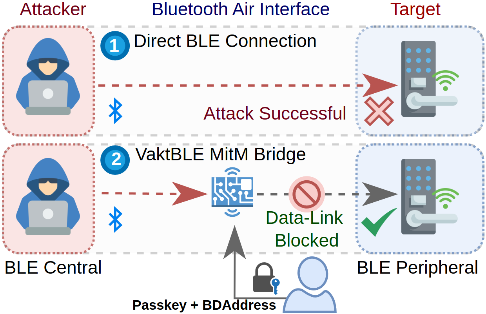
</p>

VaktBLE artifacts paper received the following badges in ACSAC'24:

<div style="text-align: center;">
  
  
  
</div>


------

**Table of Contents**

1. [📋 Requirements](#1--requirements)

    * 1.1 [Hardware Dependencies](#11-hardware-dependencies)
    
    * 1.2 [Software Dependencies](#12-software-dependencies)

    * 1.3 [Project Structure](#13-project-structure)

2. [🛠️ Build VaktBLE from source](#2-build-vaktble-from-source)

    * 2.1 [Flashing the Firmware](#21-flashing-the-firmware)

3. [🛡️ Deploying VaktBLE](#3-️-deploying-vaktble)

    * 3.1 [Anchored setup](#31-anchored-setup)

    * 3.2 [Portable setup](#32-portable-setup)

4. [☢️ Launching BLE attacks](#4-️-launching-ble-attacks)

    * 4.1 [Sweyntooth Attacks](#41-sweyntooth)

    * 4.2 [Non-Sweyntooth Attacks](#42-non-sweyntooth-attacks)
        
      * 4.2.1 [BLEDiff](#421-injectable-attack)

      
      * 4.2.2 [CyRC](#422-cyrc-attacks)
    
      * 4.2.3 [InjectaBLE](#423-blediff-attacks)

    * 4.3 [Fuzzer](#43-fuzzer)

5. [✅ Attacks detected by VaktBLE](#5--attacks-detected-by-vaktble)

    * 5.1 [Summary](#51-summary)

6. [📝 Citing VaktBLE](#6--citingvaktble)

------


## 1. 📋 Requirements

The platform is designed for two setups: an anchored setup using a PC (x86_64) and a portable setup using an embedded Linux system (Orange Pi Zero 3 with ARM Cortex-A53).

### 1.1 Hardware dependencies

* nRF52840-DK - MitM Peripheral (non-compliant)
* nRF52840-Dongle - MitM central (non-compliant)
* ESP32 DevKit - Vulnerable BLE target
* nRF52840-Dongle - Malicious Central

### 1.2 Software depenencies
The software dependencies are provided in the script *AnchoredSetup/requirements.sh* Such scripts are intended to be executed under Ubuntu 22.04. However, the main runtime dependencies are listed below:

* Wireshark 4.1.0 (Included with artifact)
* Python3 ≥ 3.8.10 (Included with artifact)
* Zephyr Bluetooth Stack Architecture (Included with artifact)
* Espressif IoT Development Framework v5.0.1

### 1.3 Project Structure 

```bash
VaktBLE
├── AnchoredSetup               # Source files for VaktBLE Anchored setup (Python3)
├── PortableSetup               # Source files for VaktBLE Portable setup (C++)
│   ├── firmware_peripheral     # Firmware for peripheral side of VaktBLE bridge
│   └── firmware_central        # Firmware for central side of VaktBLE bridge
├── Attacks                     # Scripts to launch BLE attacks (SweynTooth, CyRC, BLEDiff, InjectaBLE)
├── firmware_attacker           # Firmware for Attacker Dongle
├── firmware_target             # Sample firmware for ESP32 boards (BLE targets)
└── Eval                        # Python scripts to assist in reproducing results from the VaktBLE paper

```
## 2. 🛠️ Build VaktBLE from source
VaktBLE can be installed by running a series of scripts that automatically manage the installation of necessary dependencies for both VaktBLE and additional scripts used to execute BLE attacks and flash the non-compliant VaktBLE firmware. The full installation process is outlined in the steps below:

```bash
cd $HOME
git clone https://github.com/asset-group/vakt-ble-defender.git

#Install system requirements for Anchored Setup.
cd $HOME/vakt-ble-defender/AnchoredSetup/bridge
./requirements.sh

# Install system requirements for Portable Setup.
cd $HOME/vakt-ble-defender/PortableSetup
./requirements.sh dev
./build.sh # Build Portable Setup

# Install system requirements for BLE Attacks such as Sweyntooth, BLEDiff, etc.
cd $HOME/vaktble-ble-defender/Attacks/
./requirements.sh
```
### 2.1 Flashing the Firmware

 #### Flash the vaktBLE Firmware:
The binaries of our firmware are separated for the peripheral and the central that composes our MiTM.  With both a nRF52840-Dongle and nRF52840-DK in hand, put the first nRF52840-Dongle (non-compliant peripheral) in DFU mode (reset the USB dongle while it is connected to your PC by pressing the small reset button) and run the following commands:

```bash
# Flash the non-compliant peripheral
cd $HOME/vakt-ble-defender/PortableSetup
./firmware.sh peripheral build
./firmware.sh peripheral flash
```

In order to flash the non-compliant peripheral put the nRF52840-DK in DFU mode and run the follow commands:

```shell
cd PortableSetup/
sudo chown $USER:$USER /dev/ttyACM0 # Give user permission to serial port
./firmware.sh peripheral flash
./firmware.sh central flash 
```

 #### Flash the **Attacker Firmware**:
In order to launch an attack you can attach a nRF52840 Dongle and flash it as a central deivce. You need to install nrfutil tool to flash the firmware on the board. Remember to put the nRF52840 on DFU mode before flashing (reset the USB dongle while it is connected to your PC by pressing the small reset button),then you can run the following commands:


```shell
# Flash the attacker dongle
cd $HOME/vakt-ble-defender/firmware_attacker
python3 -m pip install nrfutil pyserial pycryptodome six
nrfutil dfu usb-serial -p COM_PORT -pkg nRF52_driver_firmware.zip
./firmware.py attacker build
./firmware.py attacker flash
```

The scripts are functional on both Linux and Windows. All that's required is to modify the COM_PORT parameter to correspond with the nRF52840 port name. You can use dmesg -w to verify the port.

#### Flash the **InjectaBLE Firmware**

Similar to the instructions on how to flash the VaktBLE firmware, put the nRF52840-Dongle in DFU mode and run the following commands:

```shell
# Flash the InjectaBLE dongle
cd $HOME/vakt-ble-defender/Attacks/Non-Sweyntooth/injectable/injectable_firmware
make send
```
After the make command finishes, you can verify if the dongle is detected by your operating system. An example of the output is shown as follows:
<p align="center">
  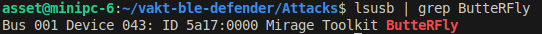
</p>

#### Flash BLE Target Firmware
The following commands can download and install the peripheral sample code in a development board with ESP32/ESP32-C3 SoC (e.g., ESP32-DevKitC, ESP-WROVER-KIT,)

```shell
cd $HOME
git clone https://github.com/espressif/esp-idf.git
cd esp-idf
git checkout a4afa44
./install.sh
source ./export.sh
cd $HOME/vakt-ble-defender/firmware_target/
idf.py set-target esp32
idf.py build # Finally to build and flash
idf.py -p /dev/ttyUSB0 flash
```

## 3. 🛡️ Deploying VaktBLE

#### 3.1 Anchored Setup

VaktBLE determines and displays in the terminal whether a specific packet matches a particular "Validation Type." Below is a list of the possible validation types, as shown in the "Validation Type" column of Table 2 in the VaktBLE paper:
| Validation Type  | Description |
|------------------|-------------|
| **Valid**        | Indicates that the received packet from the central is valid and will be forwarded to the peripheral under protection (e.g., ESP32/Moto G 5S). |
| **Malformed**    | The packet has been rejected by the Decoding or Filtering component (refer to Figure 4 in the VaktBLE paper) and will not be forwarded to the peripheral under protection. |
| **Flooding**     | The packet has been rejected by the Filtering component and will not be forwarded to the peripheral under protection. |
| **Out-of-Order** | The packet has been rejected by the FSM Check component and will not be forwarded to the peripheral under protection. |
| **MIC Error**    | The packet has been rejected by the Encryption component and will not be forwarded to the peripheral under protection. |


Once the Anchored setup is configured, we only need to place the VaktBLE MiTM bridge nearby and input the MAC address of the peripheral to defend (e.g., ESP32 DevKit). We can create the benevolent MiTM bridge as follows to test the environment:

```shell
# Address of target peripheral to protect (ESP32DevKit)
cd $HOME/vaktble-ble-defender/AnchoredSetup/bridge
./run.sh C8:C9:A3:D3:65:1E # Run VaktBLE to defend ESP32DevKit
```
After running the above command, you would see a similar output as below:

<p align="center">
  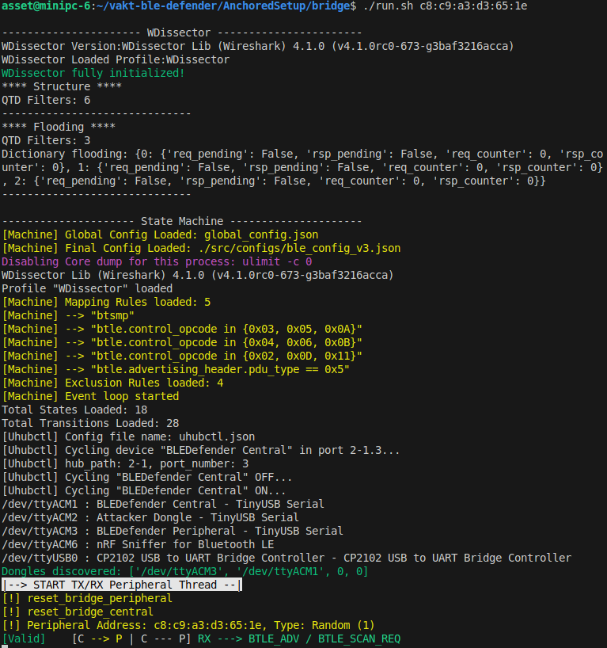
</p>


**Note:** VaktBLE must be running in a separate terminal during all times when launching any BLE attack.

### 3.2 Portable Setup

Since our Portable setup contains lightweight validation software in C++, the most significant difference is the reduction of the overhead introduced by our MiTM. We can simply run the Portable setup as follows:

```shell
cd $HOME/vaktble-ble-defender/PortableSetup/
sudo bin/vaktble --debug-pkt-peripheral --name nimble-bleprph --channel 39
```

Where `--debug-pkt-peripheral` enables the debug of the packets from and to the peripheral, `--name nimble-bleprph` is the name of the peripheral, and we can specify the BLE channel (i.e,. 39) with `-channel 39` argument.

The output of the Portable setup is shown below:

<p align="center">
  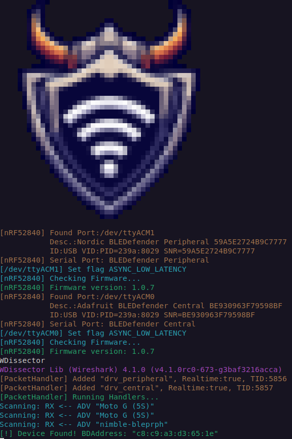
</p>


### 4.1 Sweyntooth Attacks

Launching Sweyntooth attacks is done via a Python3 virtual enviroment, such enviroment can be activated as follows:

```shell
cd $HOME/vaktble-ble-defender/Attacks/Sweyntooth
source venv/bin/activate
```

Next, you can launch the attacks in a new terminal within the directory as follows:

```shell
export ADDR=c8:c9:a3:d3:65:1e # Set target BDAddress here (ESP32)
./link_layer_length_overflow.py $ADDR # CVE-2019-16336 - Link Layer Length Overflow
./Microchip_invalid_lcap_fragment.py $ADDR # CVE-2019-19195 - Invalid L2cap fragment
./llid_deadlock.py $ADDR # CVE-2019-17060 - LLID Deadlock
./Microchip_invalid_lcap_fragment.py $ADDR # CVE-2019-17517 - Truncated L2CAP
```

Once we launched both VaktBLE and an attack, the output should be similar as below:
<div>
  <div align="center">
    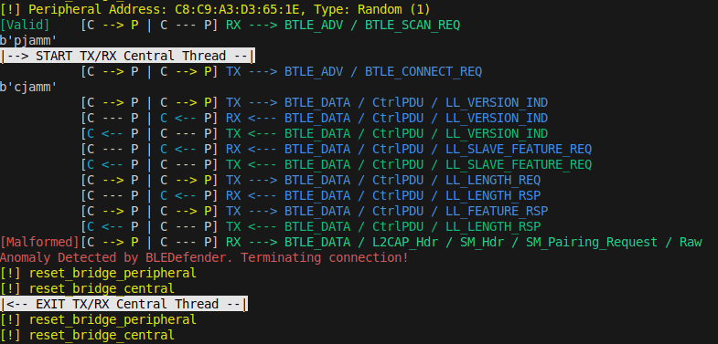
    <p style="text-align: center;">Anchored Setup MiTM example <br> of packet detection output</p>
  </div>
  <div align="center">
    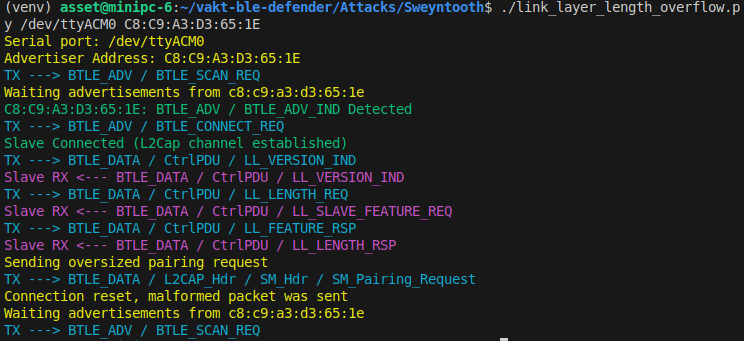
    <p style="text-align: center;">Attacker log generated when sending an <br> invalid Pairing request</p>
  </div>
</div>

The Sweyntooth attack script link_layer_overflow.py did not succeed in its attempt because VaktBLE identified the malformed packet and immediately terminated the connection to prevent further exploitation.

### 4.2 Non-Sweyntooth Attacks

#### 4.2.1 InjectaBLE Attack
InjectaBLE enables central hijacking attacks by injecting an *LL_CONNECTION_UPDATE_IND* packet and syncing with the peripheral during connection parameter updates. For this, we used a Moto G 5S as the central and an ESP32-DevKitC as the peripheral. You can display the phone screen on Linux (tested on Ubuntu 22.04) using the **scrcpy** project as follows:
```shell
sudo apt install -y scrcpy
adb devices # Accept ADB authorization from phone
scrcpy # Screen of the phone should open in ~2 seconds
```

In a new terminal you can launch InjectaBLE as follows:

```shell
cd vakt-ble-defender/Attacks/Non-Sweyntooth/injectable
./attack_hijack_master.sh
```

Additionally, we installed the [nRF Connect for Mobile](https://www.nordicsemi.com/Products/Development-tools/nRF-Connect-for-mobile) app on the phone to connect to the target (nimble-prph). Once installed, you can open the app and connect via the screen displayed in Ubuntu.

On the logs shown below, the attack tries to inject a *LL_CONNECTION_UPDATE_REQ* packet while impersonating the central device. 
On the Left side: MotoG 5S already disalready disconnected to the target device. 
Upper right: VaktBLE logs. Since *LL_CONNECTION_UPDATE_REQ* is transparent to our bridge, the target device keeps sending LL_FEATURE_REQ until timeouts. By design, VaktBLE rejects this message injected by InjectaBLE, preventing it from proceeding further with the attack. 

<p align="center">
  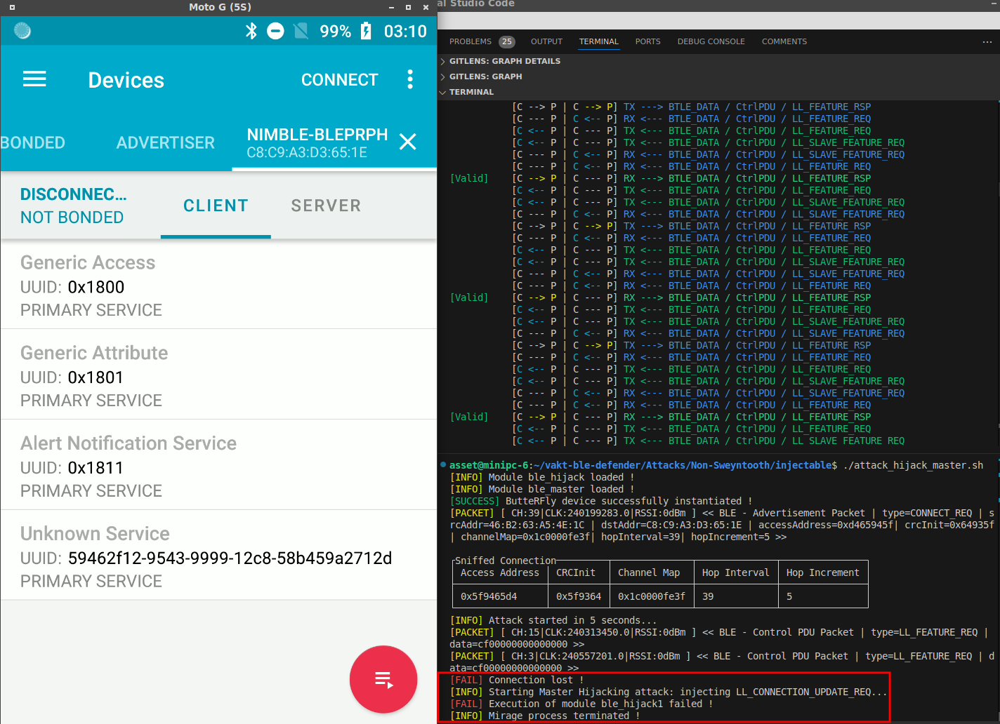
</p>


#### 4.2.2 CyRC Attacks
CyRC attacks can be launched using python environment from sweyntooth under Attacks/Non-
Sweyntooth/CyRC directory as follows: 

```shell
cd /vakt-ble-defender/Attacks/Non-Sweyntooth/CyRC
source venv/bin/activate
export ADDR=c8:c9:a3:d3:65:1e

#Launch attack
./assertion_failure_LL_CONNECTION_PARAM.py $ADDR # CVE-2021-3430 Assertion failure on repeated LL_CONNECTION_PARAM_REQ

```
An example of a CyRC attack detection by VaktBLE blocking Multiple LL_CONNECTION_PARAM_REQ packets (Flooding attack), is shown as follows:

<p align="center">
  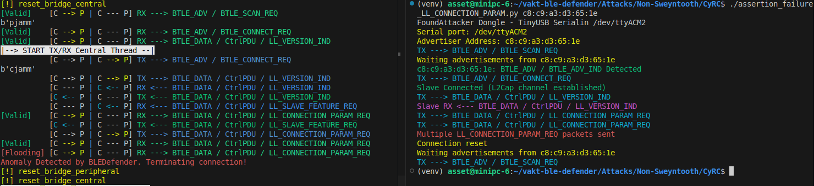
</p>

#### 4.2.3 BLEDiff Attacks

For BLEDiff testing, we used a MotoG 5S phone to test two attacks: bypassing passkey entry (E1) and bypassing legacy pairing (E3), both involving legacy pairing compatibility. To improve testing efficiency and reproducibility, we modified our scripts to automatically detect the phone's Random Address. This required enabling the RANDOM ADDRESS setting in the smartphone's nRF Connect app under the ADVERTISER tab: 

<p align="center">
  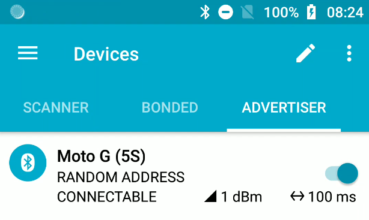
</p>

We can launch CyRC attacks running the following commands:

```shell
./bypassing_legacy_pairing_passkey.py # (E1) Bypassing passkey entry in legacy pairing
./bypassing_legacy_pairing.py # (E3) Bypassing legacy pairing
./key_size_greater_than_max.py c8:c9:a3:d3:65:1e # (O1) Accepting key size greater than max
./e6unresponsiveness_timeout_zero.py c8:c9:a3:d3:65:1e #) (E6 Unresponsiveness with Conn. Parameters
```

The output shown below shows how the attack (E1 Legacy pairing passkey) works by displaying both the terminal output and phone display. This test was performed on the MotoG 5S, which supports legacy pairing. While E1 and E3 attacks only work on legacy pairing devices, other attacks like O1 and E6 can be used on a wider variety of devices, including ESP32, as shown in our paper's Table 2.

<p align="center">
  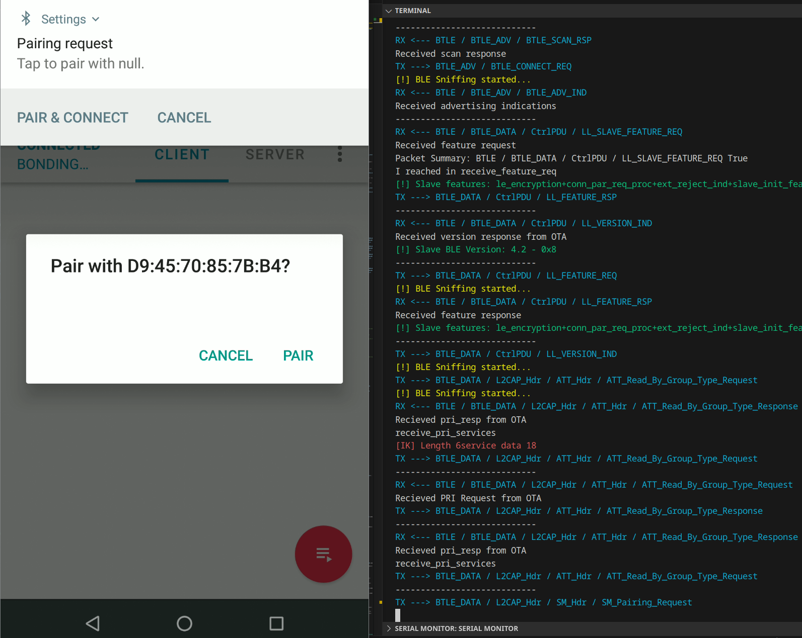
</p>


### 4.3 Fuzzer 

You can also test VaktBLE using a BLE fuzzer as follows:

First, we specify the correct parameters for the target in *vakt-ble-defender/Attacks/Fuzzer/ble_central.py* at the bottom of the Python code. Specifically, update line 2319 with the target address *(slave_address)* and line 2321 with the dongle serial port from the attacker *(dongle_serial_port)*.

```shell
model = BLECentralMethods(states, transitions,
master_mtu=247, # 23 default, 247 max (mtu must be 4 less than max \
length)
slave_address=23,
master_address=’c8:c9:a3:d3:65:1e’,
dongle_serial_port=’/dev/ttyACM2’,
baudrate=115200,
monitor_magic_string=’ESP-IDF v4.1’
enable_fuzzing=True,
enable_duplication=True)
model.get_graph().draw(’bluetooth/ble_central.png’, prog=’dot’)
model.sniff()
# try:
while True:
sleep(1000)
```

Secondly we can proceed to execute the fuzzer as follows:

```shell
sudo ./greyhound.py ble_central
```

An example of VaktBLE output detection and the BLE fuzzer running can be better depicted below:

<div>
  <div align="center">
    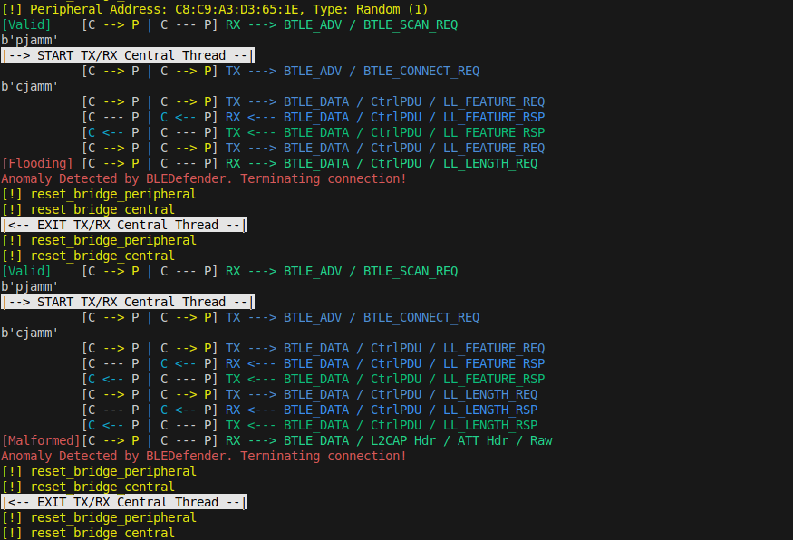
    <p style="text-align: center;">Anchored Setup MiTM example <br> of packet detection output</p>
  </div>
  <div align="center">
    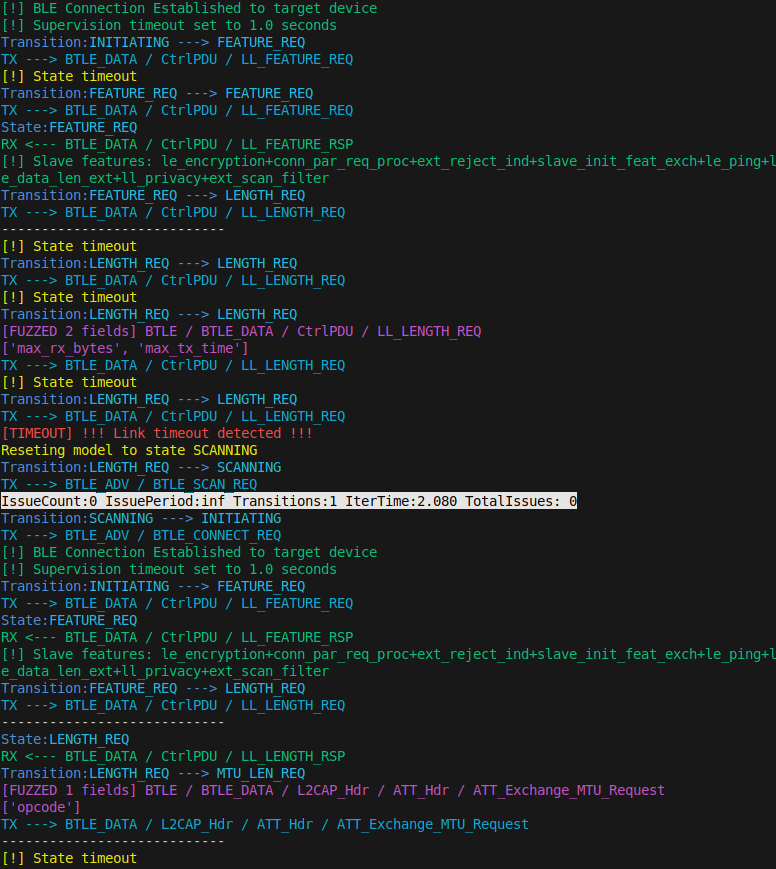
    <p style="text-align: center;">Fuzzer log</p>
  </div>
</div>

## 5. 📊 Attacks detected by VaktBLE

<div style="overflow-x: auto;">

|  | Attack Name | Malformed/Non-compliant | Flooding | State Machine Model | Encryption | Connectivity | VaktBLE Overhead (avg) | Time to hijack the channel (avg) | Target Peripheral |
|---|-------------|-------------------------|----------|---------------------|------------|--------------|------------------------|-----------------------------------|--------------------|
| **Sweyntooth** | CVE-2019-16336 - Link Layer Length Overflow | ✅ | | | | 10/10 | 18.3 ms | 40.3 ms | ESP32-Wrover-Kit-VE |
| | CVE-2019-19195 - Invalid L2cap fragment | ✅ | | | | 10/10 | 9.2 ms | 60.2 ms | ESP32-DevKitC |
| | CVE-2019-17060 - LLID Deadlock | ✅ | | | | 10/10 | 15.9 ms | 35.3 ms | ESP32-Wrover-Kit-VE |
| | CVE-2019-17517 - Truncated L2CAP | ✅ | | | | 10/10 | 7.2 ms | 38.5 ms | ESP32-Wrover-Kit-VE |
| | CVE-2019-17518 - Silent Length Overflow | ✅ | | | | 10/10 | 12.3 ms | 60.2 ms | ESP32-Wrover-Kit-VE |
| | CVE-2019-17520 - Public Key Crash | | | ✅ / Legacy Pairing | | 10/10 | N/A | N/A | ESP32-Wrover-Kit-VE |
| | CVE-2019-19193 - Invalid Connection Request | ✅ | | | | 10/10 | 8.0 ms | 60.1 ms | ESP32-Wrover-Kit-VE |
| | CVE-2019-19192 - Sequential ATT Deadlock | | ✅ | | | 10/10 | 6.8 ms | 50.2 ms | ESP32-Wrover-Kit-VE |
| | CVE-2019-19196 - Key Size Overflow | ✅ | | | | 10/10 | 10.3 ms | 30.2 ms | Moto G 3S |
| | CVE-2019-19194 - Zero LTK Installation | | | ✅ / Legacy Pairing | | 10/10 | 10.5 ms | 40.3 ms | Moto G 3S |
| | CVE-2020-13393 - DHCheck Skip | | | ✅ / Secure Connection | | 10/10 | 7.5 ms | 60.2 ms | ESP32-Wrover-Kit-VE |
| | CVE-2020-13595 - ESP32 HCI Desync | | | | ✅ | 10/10 | 8.3 ms | 50.1 ms | ESP32-Wrover-Kit-VE |
| | CVE-2020-10061 - Zephyr Invalid Sequence | ✅ | |  | | 10/10 | 9.0 ms | 48.8 ms | ESP32-Wrover-Kit-VE |
| | CVE-2020-10069 - Invalid Channel Map | ✅ | | | | 9/10 | 10.3 ms | 35.3 ms | ESP32-Wrover-Kit-VE |
| **Non-Sweyntooth** | InjectaBLE - Hijacking the Peripheral via Central Impersonation (MitM) | _ | _ | _ | _ | 10/10 | N/A | N/A | ESP32-DevKitC |
| | CVE-2019-9506 - BLE KNOB Variant | | | | | 10/10 | 10.3 ms | 60.2 ms | ESP32-Wrover-Kit-VE |
| | BLEDiff - (E1) Bypassing passkey entry in legacy pairing | | | ✅ / Legacy Pairing | | 9/10 | 7.2 ms | 32.5 ms | Moto G 3S |
| | BLEDiff - (E3) Bypassing legacy pairing | | | ✅ / Legacy Pairing | | 10/10 | 7.2 ms | 35.5 ms | Moto G 3S |
| | BLEDiff - (O1) Accepting key size greater than max | ✅ | | | | 10/10 | 8.9 ms | 35.7 ms | Moto G 3S |
| | BLEDiff - (E4) Accepts DHKeyCheck equals zero | ✅ | | | | 10/10 | 7.2 ms | 38.5 ms | ESP32-Wrover-Kit-VE |
| | BLEDiff - (E6) Unresponsiveness with ConReqIntervalZero | ✅ | | | | 10/10 | 8.7 ms | 38.5 ms | Moto G 3S |
| | CVE-2021-3430 - CyRC: Assertion failure on repeated LL packets | | ✅ | | | 10/10 | 8.9 ms | 35.7 ms | ESP32-Wrover-Kit-VE |
| | CVE-2021-3431 - CyRC: Assertion failure on LL_CONNECTION_PARAM_REQ | | ✅ | | | 10/10 | N/A | N/A | ESP32-Wrover-Kit-VE |
| | CVE-2021-34333 - CyRC: Invalid channel map in CONNECT_IND results to deadlock | ✅ | | | | 10/10 | N/A | N/A | ESP32-Wrover-Kit-VE |
| | CVE-2021-3454 - CyR CL2CAP: Truncated K-frame causes assertion failure | ✅ | | | | 10/10 | N/A | N/A | ESP32-DevKitC |

</div>

# Full Documentation

For more information on VaktBLE, please read our artifact PDF, which includes a detailed description on how to run the experiments performed in VaktBLE [artifacts paper](AnchoredSetup/docs/vaktble_documentation.pdf).

# 📝 Citing VaktBLE
If you use VaktBLE in your research, you can cite our paper:

```
@inproceedings{
  author={Benita, Geovani and Sestrem, Leonardo and Garbelini, Matheus E and Chattopadhyay, Sudipta and Sun, Sumei and Kurniawan, Ernest},
  booktitle={40th Annual Computer Security Applications Conference (ACSAC 2024)}, 
  title={VaktBLE: A Benevolent Man-in-the-Middle Bridge to Guard against Malevolent BLE Connections}, 
  year={2024},
}
```